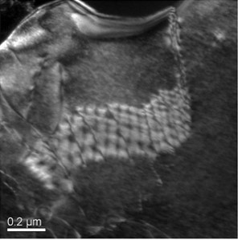
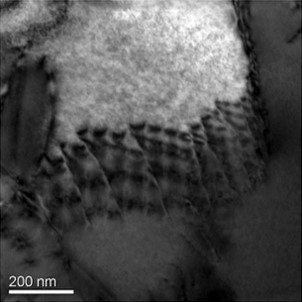

### Post Test

1. The following TEM micrograph is **\*\*\*\***\_**\*\*\*\*** image. 
    
   A.<input type="radio" name="but" id="rb11" onclick="click1();">&nbsp;Dark-field image
    
   B.<input type="radio" name="but" id="rb12" onclick="click1();">&nbsp;Bright Field Image
    
   C.<input type="radio" name="but" id="rb13" onclick="click1();">&nbsp;
    
   D.<input type="radio" name="but" id="rb14" onclick="click1();">&nbsp;
    
   

    
2. The bright field imaging contrast in TEM can NOT be increased by enhancing:
    
   A. <input type="radio" name="but2" id="rb21" onclick="click2();">&nbsp;Mass-thickness difference of existing constituents
    
   B. <input type="radio" name="but2" id="rb22" onclick="click2();">&nbsp;selective diffraction of existing constituents
    
   C. <input type="radio" name="but2" id="rb23" onclick="click2();">&nbsp;absorption between phase of existing constituents
    
   D. <input type="radio" name="but2" id="rb24" onclick="click2();">&nbsp;accelerating voltage for imaging of existing constituents
     
   

    

3. Bright field image is obtained when **\*\***\_\_\_\_**\*\*** beam is captured to form image after it transmits through the sample
    
   A. <input type="radio" name="but4" id="rb41" onclick="click4();">&nbsp;Direct beam
    
   B. <input type="radio" name="but4" id="rb42" onclick="click4();">&nbsp;Diffracted beam
    
   C. <input type="radio" name="but4" id="rb43" onclick="click4();">&nbsp;Inelastically scattered beam
    
   D. <input type="radio" name="but4" id="rb44" onclick="click4();">&nbsp;None of these
     
   

    
4. Dark field image is obtained when **\*\***\_\_\_\_**\*\*** beam is captured to form image after it transmits through the sample
    
   A. <input type="radio" name="but3" id="rb31" onclick="click3();">&nbsp;Direct beam
    
   B. <input type="radio" name="but3" id="rb32" onclick="click3();">&nbsp;Diffracted beam
    
   C. <input type="radio" name="but3" id="rb33" onclick="click3();">&nbsp;Inestically scattered beam
    
   D. <input type="radio" name="but3" id="rb34" onclick="click3();">&nbsp;None of these
     
   

    
5. The following TEM micrograph is **\*\*\*\***\_**\*\*\*\*** image ;
    
   A. <input type="radio" name="but4" id="rb41" onclick="click4();">&nbsp;Dark-field image
    
   B. <input type="radio" name="but4" id="rb42" onclick="click4();">&nbsp;Bright Field Image
    
   C. <input type="radio" name="but4" id="rb43" onclick="click4();">&nbsp;
    
   D. <input type="radio" name="but4" id="rb44" onclick="click4();">&nbsp;
     
   

    
