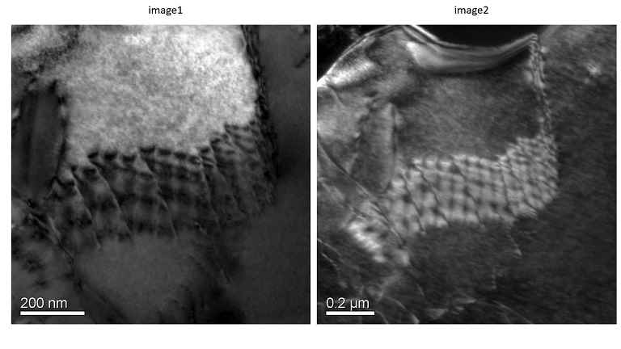

## Bright Field/ Dark Field:
In the imaging mode, bright field image is obtained if the signal is collected on the screen when the direct beam (on the back focal plane of objective lens) is captured to form image after it transmits through the sample (Fig. 1a). On the other hand, dark field image is obtained when the diffracted beam (on the back focal plane of objective lens) is captured to form image. It may be noted that the diffraction pattern (Fig. 2c) has the diffracted pattern (mostly from multiple nanocrystalline regions) and also from the direct beam (central spot). If the direct beam is allowed to pass through, it forms a bright field image (Fig. 2b). It may be noted in the bright field image (Fig. 2b) that the background is bright, and features are dark (hence the name: bright field image). Whereas, one of the diffracted beam is allowed to form image as dark-field image (Fig. 2c). It may be noted that the background is dark, and the features appear bright (hence the name: ‘dark field image’).   
 
  
Fig. 1: a) direct beam is allowed to pass through for forming a bright field image, and b) diffracted beam being allowed to pass through in order to form dark field image.  
 
Fig. 2: TEM Micrographs of a ceramic material showing a) bright field (Image1), and b) dark field (Image 2).  

It is important to highlight the contrast in the TEM images. Contrast is defined as the ratio of intensity of the signal from feature to that of the background. As the features appear dark, and the field appears bright, hence the features are sometimes missed during analysis. But, the dark field imaging (see Fig. 2b) highlights the features appearing brighter. Hence the features can be highlighted and deciphered from the nearby regions. There are other ways in which the contrast is naturally obtained in the TEM images, which include amplitude contrast and phase contrast.   
Amplitude contrast is obtained when there is preferential absorption of electron due to higher thickness or its scattering (or diffraction). Amplitude contrast can be classified into: (i)  mass-thickness contrast, wherein high mass (or thickness) scatters the incident electrons to higher angles, which go undetected by the objective aperture, or (ii) diffraction contrast, wherein the electron beam gets selectively diffracted (or appropriately oriented crystalline region) of the specimen.<b> Phase contrast</b> is obtained when the electron interaction with matter shifts the waves of similar thickness materials (but of different phases or orientation). Thus, this contrast can also be utilised to separate out the different density or regions with different atoms, or even with different atomic density (or planar density). 
 

The selection of the direct beam or diffracted beam is analogous to capturing the information concerning that particular feature the beam has interacted with. If certain crystals have diffracted the incident beam, the scattering will occur as per Bragg’s condition. But, the orientation of each feature in similar fashion will scatter it at same angle. Thus, imaging from one diffracted beam (keeping the aperture and allowing it to form an image) may show few features bright (and the field will be dark). Important point to note here is that if another diffracted beam is allowed to pass through, then some other features will appear bright (and the field will remain dark). In summary, each diffracted spot is appearing due to specific orientation of certain features, which will start to appear bright if that diffracted beam is allowed to form the image. And in bright field mode, those features may or may not appear bright. 
<video width="320" height="240" controls>
  <source src="images/"exp6-BF-DF-Imaging.mp4 type="video/mp4">
  Your browser does not support the video tag.
</video> 
Fig:Video on Bright Field Imaging and Dark Field Imaging

