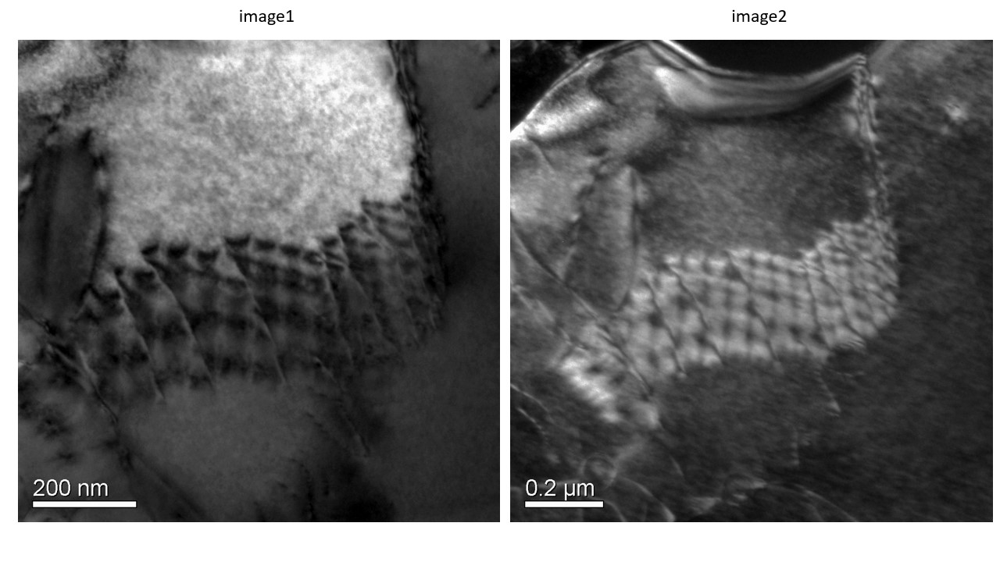

## Pedagogy (Round 1)

 
 
<b> Experiment: Bright Field Imaging and Dark Field Imaging   

<b>Discipline | <b>Materials Science Engineering
:--|:--|
<b> Lab | <b> Electron Microscopy For Beginners 
<b> Experiment|     <b> 1. Bright Field Imaging and Dark Field Imaging

<h4> [1. Focus Area](#LO)
<h4> [2. Learning Objectives ](#LO)
<h4> [3. Instructional Strategy](#IS)
<h4> [4. Task & Assessment Questions](#AQ)
<h4> [5. Simulator Interactions](#SI)

#### 1. Focus Area : Reinforce theoretical concept 
Instrumentation and Practical skills
#### 2. Learning Objectives and Cognitive Level

Sr. No |	Learning Objective	| Cognitive Level | Action Verb
:--|:--|:--|:-:
1.| 	Student will be able to learn how to perform bright field imaging | Apply |Apply
2.| Student will be able to learn how to perform Dark field imaging | Apply | Apply

 

    <b><a href="#top">↥ back to top</a></b>

 

#### 3. Instructional Strategy
###### Name of Instructional Strategy  :    <u> Expository
###### Assessment Method: summative

<u> <b>Description: </b> of how you are going to implement the above Instructional Strategy in your Simulator: </u>
 
 Experimental results will be used along with animation.

 

    <b><a href="#top">↥ back to top</a></b>

 

#### 4. Task & Assessment Questions:

Read the theory and comprehend the concepts related to the experiment. [LO1, LO2, LO3]
 

Sr. No |	Learning Objective	| Task to be performed by   the student  in the simulator | Assessment Questions as per LO & Task
:--|:--|:--|:-:
1.| Student will be able to learn how to perform bright field imaging | Selecting the ROI - Setting up the diffraction pattern - Inserting the objective aperture - Selecting the transmitted spot using objective aperture - Imaging the bright field micrograph | 1.Identify the bright field image. <b>a.image1</b> b.image2 
2.| Student will be able to learn how to perform Dark field imaging | - Selecting the ROI - Setting up the diffraction pattern - Inserting the objective aperture - Setting up the two beam condition - Selecting the diffracted spot using objective aperture - Imaging the dark field micrograph | Identify the dark field image. a.image1 <b>b.image2</b> 

  
 

    <b><a href="#top">↥ back to top</a></b>

 

#### 4. Simulator Interactions:
 

Sr.No | What Students will do? |	What Simulator will do?	| Purpose of the task
:--|:--|:--|:--:
1.| Students will acquire bright field image | 1 Simulator will enable the students to play with the virtual controllers and understand its operation.  | 1 Learning about the bright field imaging
2.| Students will acquire dark field image | Simulator will guide the students about the steps to be followed  | Learning about the dark field imaging
